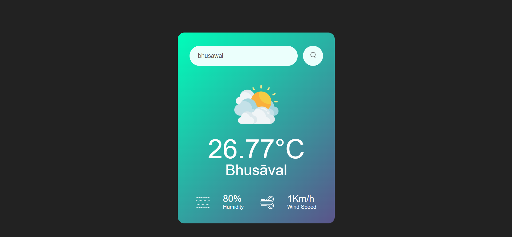
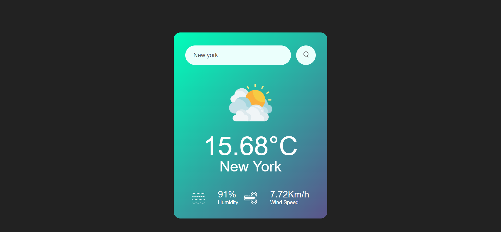

# Weather App

A simple weather app/website that allows users to check the weather forecast for different locations.

## Demo

You can check out a live demo of the weather app/website [[here](https://weather-app-harsh-chaudhari.netlify.app/)](#).



## Features

- Display current weather conditions for a specified location.
- Responsive design for various screen sizes.
- User-friendly interface.

## Technologies Used

- HTML
- CSS
- JavaScript
- [Weather API](https://openweathermap.org/api)

## Getting Started

To get a copy of this project up and running on your local machine, follow these steps:

1. Clone the repository:

   ```bash
   git clone https://github.com/your-username/weather-app.git
